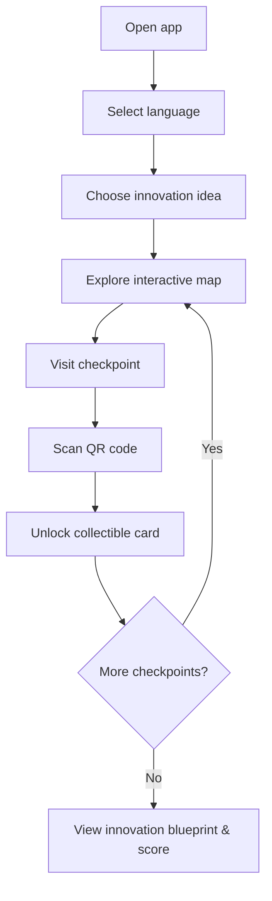

<div align="center">


#  Jelajah Solo Technopark


**A location-based gamified exploration app — scan checkpoints, collect cards, build your innovation blueprint.**

[]()
[]()
[]()
[]()
[]()
[]()

</div>

---

Instead of just walking through Solo Technopark, visitors complete real-world checkpoints, scan QR codes, unlock collectible cards, and watch it all assemble into a final **innovation blueprint** — turning a physical visit into a game.

## Table of Contents

- [Jelajah Solo Technopark](#jelajah-solo-technopark)
  - [Table of Contents](#table-of-contents)
  - [Overview](#overview)
  - [Features](#features)
  - [User Journey](#user-journey)
  - [Tech Stack](#tech-stack)
  - [Project Structure](#project-structure)
  - [Project Goals](#project-goals)
  - [License](#license)

##  Overview

| | |
|---|---|
| **What it is** | A mobile-first web app that gamifies a physical visit to Solo Technopark |
| **How it works** | Explore an interactive map → scan QR codes at checkpoints → unlock cards → get a scored innovation blueprint |
| **Who it's for** | Visitors, students, and event attendees exploring the Technopark |
| **Data layer** | Supabase, with offline fallback and local sync queue |

## Features

<details>
<summary><strong> Landing Experience</strong></summary>
<br>

- Language selection (Indonesian & English)
- Product idea selection before starting
- Guided onboarding flow
</details>

<details>
<summary><strong> Interactive Map</strong></summary>
<br>

- Zoom and pan support
- Interactive checkpoint markers
- Last-visited checkpoint highlighting
- Restricted area visualization
</details>

<details>
<summary><strong> QR Code Checkpoints</strong></summary>
<br>

- Camera-based QR scanning
- Manual code input fallback
- Location-based progression
- Secure checkpoint validation
</details>

<details>
<summary><strong> Card Collection System</strong></summary>
<br>

- Hidden cards unlocked after checkpoint completion
- Animated card reveal experience
- Inventory for collected cards
- Detailed card information view
</details>

<details>
<summary><strong> Innovation Blueprint</strong></summary>
<br>

- Summary of collected cards
- Scoring system
- Bonus points based on selected innovation idea
- Final innovation overview
</details>

<details>
<summary><strong> Progress Persistence</strong></summary>
<br>

- Automatic local storage saving
- Resume previous progress
- Stores selected idea, scanned checkpoints, collected cards, and last visited location
</details>

<details>
<summary><strong> Data Integration</strong></summary>
<br>

- Dynamic content from Supabase
- Offline snapshot fallback
- Offline statistics queue
- Automatic sync when back online
</details>

<details>
<summary><strong> Admin Panel</strong></summary>
<br>

- Secure administrator login
- Edit checkpoint information
- Manage teaser and reveal content
- Configure checkpoint accessibility
</details>

<details>
<summary><strong>🎨 Modern UX</strong></summary>
<br>

- Responsive, mobile-first interface
- Rounded cards and glassmorphism effects
- Smooth transitions and animations
- Bilingual UI throughout
</details>

##  User Journey



##  Tech Stack

| Layer | Technology |
|---|---|
| Frontend | HTML, CSS, JavaScript |
| Backend | Supabase |
| Persistence | Local Storage API |
| Scanning | QR Code Scanner API |
| Design | Responsive Web Design |

##  Project Structure

```
project/
├── assets/     # images, icons, illustrations
├── css/        # stylesheets
├── js/         # app logic
├── pages/      # app screens
├── admin/      # admin panel
├── data/       # static / seed content
└── README.md
```

##  Project Goals

- Transform a physical location into an interactive exploration experience
- Encourage discovery through gamification
- Connect real-world exploration with digital rewards
- Promote innovation through collectible knowledge cards
- Provide an easy-to-maintain content management system for administrators

## License

This project is intended for educational and demonstration purposes. Please refer to the repository license for usage details.


